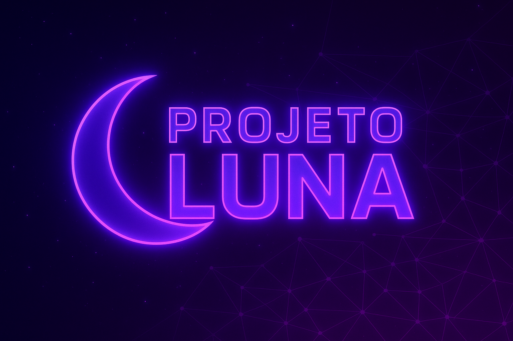

<p align="center">
  
</p>

<div align="center">

<h1>🌙 <span style="color:#ff00ff;">PROJETO LUNA</span></h1>
<h3><span style="color:#8a2be2;">Assistente Pessoal com IA, Voz e Reconhecimento Facial</span></h3>

<!-- DIVISOR BONITO -->
<hr style="border: 0; height: 3px; background: linear-gradient(90deg, #ff00ff, #8a2be2, #ff00ff); border-radius: 5px;">


<br><br>

<p>
  
  
  
  
  
</p>

</div>

<br>

<hr style="border: 0; height: 3px; background: linear-gradient(90deg, #ff00ff, #8a2be2, #ff00ff); border-radius: 5px;">


---

# ✨ Visão Geral

O **Projeto Luna** é uma assistente virtual futurista criada para oferecer **automação real**, usando:

- 🤖 **Inteligência Artificial**
- 🎤 **Comandos de voz**
- 👁️ **Reconhecimento facial**
- ⚡ **Execução automática de tarefas**
- 💜 **Interação natural e personalizada**

A Luna abre programas, responde perguntas, interage com o usuário e executa ações no sistema em segundos — tudo com visual **neon cyberpunk**.

<br>

<hr style="border: 0; height: 3px; background: linear-gradient(90deg, #ff00ff, #8a2be2, #ff00ff); border-radius: 5px;">


---

# 🌌 Funcionalidades Futuristas

## 🤖 Inteligência Artificial
- ✨ Conversação natural  
- ✨ Respostas inteligentes  
- ✨ Auxílio em tarefas  
- ✨ Interpretação de comandos complexos  

## 👁️ Reconhecimento Facial
- 💜 Identifica o usuário automaticamente  
- 💜 Personaliza a experiência  
- 💜 Autenticação moderna  

## 🎤 Comandos de Voz
- ⚡ Abrir programas  
- ⚡ Executar automações  
- ⚡ Buscar informações  
- ⚡ Controlar funções do Windows  

## 🦾 Automação do Sistema
- 🟣 Abrir Chrome  
- 🟣 Abrir Discord  
- 🟣 Abrir VSCode  
- 🟣 Tocar músicas  
- 🟣 Executar scripts personalizados  

## 🌙 Visual Futurista
- 💜 Tema neon roxo/rosa  
- 💜 Estética IA cyberpunk  
- 💜 Divisores luminosos  
- 💜 Feedback estilizado  

<br>

<hr style="border: 0; height: 3px; background: linear-gradient(90deg, #ff00ff, #8a2be2, #ff00ff); border-radius: 5px;">

---

# 🛠️ Tecnologias Utilizadas

### Ícones das Tecnologias


| Tecnologia | Descrição |
|-----------|-----------|
| **Python** | Lógica principal |
| **OpenCV** | Reconhecimento facial |
| **SpeechRecognition** | Microfone e comandos de voz |
| **PyAutoGUI** | Automação do computador |
| **gTTS / pyttsx3** | Voz da assistente |
| **APIs externas** | Base de IA e funções inteligentes |

<br>

---

# 🚀 Como Rodar

```bash
# Clone o repositório
git clone https://github.com/seu-usuario/projeto-luna

# Entre no diretório
cd projeto-luna

# Instale as dependências
pip install -r requirements.txt

# Execute a Luna
python luna.py
